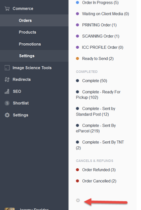

# Commerce Friendly Order Numbers plugin for Craft CMS

Use nice, client friendly consecutive order numbers with Craft Commerce

## Installation

Installation is slightly more involved than some plugins as I haven't automated everything (yet?).

First, create a new field - we use `Friendly Order Number` (the handle *must* be `friendlyOrderNumber`) - but you can actually call the field whatever you like.  

The best field type to use is a Read Only 'Incognito' field (see https://github.com/mmikkel/IncognitoField-Craft) ...however if you want to avoid another plugin, just use a `Plain Text` field.

Add this new field to your Order Fields in Commerce settings:

Then, to actually install this plugin, follow these steps:

1. Downloaded the latest release
2. Unzip and copy the plugin folder `commercefriendlyordernumbers` to your `craft/plugins` folder
3. Install plugin in the Craft Control Panel under Settings > Plugins
4. N.B. The plugin folder should be named `commercefriendlyordernumbers` for Craft to see it.  

## Setting The Starting Order Number

By default the plugin will start with order number #1.  If you want to change this, simply change the value in the database to *one less than* whatever you'd like the order numbers to start from - so if you want to start from 25001, then set the value to 25000, like so:

## Using The Friendly Order Number In Templates & Emails

Generally, you can just refer to your new order number like any other field:
 `{{ order.friendlyOrderNumber }}`

 You can of course select orders by this field, e.g. using a url segment:

``

**ONE BIG CAVEAT** - (apparently fixed in Commerce 1.2 but as yet untested by me)

If you want to use the order number in your order receipt email, it won't yet have been saved to the order's database record.  In this one case you must refer to it so:

``

(note the important `.content` in there!)

There is also a template variable helper to get the latest used order number should you want to boast about how many orders you're putting through or something:

`{{ craft.commerceFriendlyOrderNumbers.latestOrderNumber }}`

## Using The Friendly Order Number In The Control Panel

You can add the order number as a column in your order views, and then search by the number, using the standard craft approach (cog icon in Orders view):

To take it a step further you can replace Commerce order number on the order details page with your nicer number.  You'll need to use the wonderful CPJS plugin (https://github.com/lindseydiloreto/craft-cpjs) - add this JS:

    if($("body").hasClass('commerceordersedit')){
        // Change the Page Title and Order Number at the top to the Friendly Order Number
        var $pagetitle = $('#page-title');
        var FriendlyOrderNumber = $("#fields-FriendlyOrderNumber").val();
        $pagetitle.html("<h1>Order #" + FriendlyOrderNumber + "</h1>");
        document.title = "Order #" + FriendlyOrderNumber;
    }

And wa la, nice order numbers pretty much everywhere (and note you still have the Commerce number there too, of course):

## Commerce Friendly Order Numbers Changelog

Commerce Friendly Order Numbers has been tested with Craft 2.6+ and Commerce 1.1+, and is in daily use on working, live stores.

### 0.0.1 -- 2016.09.23

* Initial release

Brought to you by [Jeremy Daalder](https://github.com/bossanova808)

## Issues?

Please use github issues or find me on the Craft slack, I mostly hang out in the #commerce channel

## Icon

Public Domain, from the Noun Project
